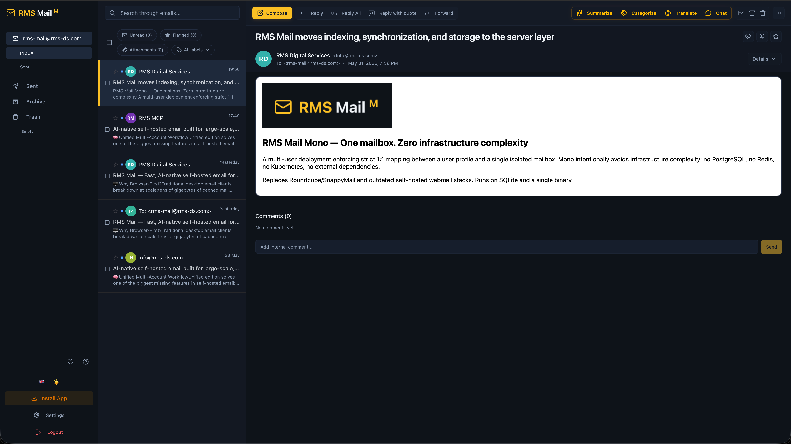
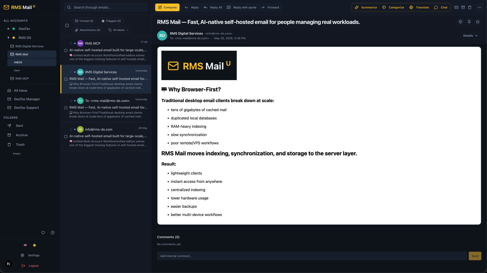

<p align="center">
  
</p>

---

<p align="center">
  
  
  
  
  
  
  
  
  
  
</p>

<p align="center">
  <b>High-performance self-hosted email built for large-scale, multi-account workflows.</b><br>
  Built for developers, operators, and power users managing real-world workloads at scale.<br>
  <i>Supercharged with an optional AI module, because modern email outgrew traditional webmail clones years ago.</i>
</p>

---

<div align="center">
  <a href="https://ko-fi.com/M7I020HKXX" target="_blank" rel="noopener noreferrer">
    
  </a>
</div>

---

## 🚧 Current State

RMS Mail is actively developed and already used in real-world workflows.

Current status:
- Mono edition: Release Candidate
- Unified edition: In active development
- Teams edition: Planned

The project currently prioritizes:
- core stability
- large-mailbox performance
- AI workflows
- infrastructure reliability
- workflow ergonomics

Documentation, walkthrough videos, and deployment guides are currently being expanded.

---

## 📑 Table of Contents

1. [🖥️ Why Browser-First?](#%EF%B8%8F-why-browser-first)
2. [💡 Why RMS Mail Exists](#-why-rms-mail-exists)
3. [🚀 What Makes RMS Mail Different?](#-what-makes-rms-mail-different)
4. [🧠 The Programmable Inbox](#-the-programmable-inbox)
5. [🛠️ Inbox Mastery at Scale](#%EF%B8%8F-inbox-mastery-at-scale)
6. [👥 Who is this for?](#-who-is-this-for)
7. [🎯 Editions](#-editions)
8. [🏗️ Architecture & Tech Stack](#️-architecture--tech-stack)
9. [⚡ Vector Search & Performance Pipeline](#-vector-search--performance-pipeline)
10. [📧 Gmail-Style Email Processing](#-gmail-style-email-processing)
11. [🌍 Internationalization (45 Languages)](#-internationalization-45-languages)
12. [🚀 Quick Start](#-quick-start)
13. [📊 Feature Matrix](#-feature-matrix)
14. [💭 Philosophy](#-philosophy)
15. [🗺️ Roadmap](#%EF%B8%8F-roadmap)
16. [🔑 Security: Database Encryption & Key Rotation](#-security-database-encryption--key-rotation)

---

## 🖥️ Why Browser-First?

Traditional desktop email clients break down at scale:
- tens of gigabytes of cached mail
- duplicated local databases
- RAM-heavy indexing
- slow synchronization
- poor remote/VPS workflows

RMS Mail moves indexing, synchronization, and storage to the server layer.

Result:
- lightweight clients
- instant access from anywhere
- centralized indexing
- lower hardware usage
- easier backups
- better multi-device workflows

---

## 💡 Why RMS Mail Exists

Modern self-hosted email is still broken. Most webmail clients:
* feel outdated (stuck in 2005)
* become painfully slow on large mailboxes
* have terrible search
* collapse under multi-account workflows
* ignore automation
* bolt AI on top as an afterthought
* force users into desktop apps that cache gigabytes locally

RMS Mail was built from real operational pain:
* many accounts
* millions of emails
* constant context switching
* support-heavy workflows
* browser-first work environments
* AI-assisted operations
* IDE-native automation

**The goal is simple: Make self-hosted email fast, programmable, scalable, and actually pleasant to use.**

---

## 🚀 What Makes RMS Mail Different?

### ⚡ Built for Huge Mailboxes
RMS Mail is designed for:
* tens of accounts
* hundreds of folders
* millions of emails
* bulk operations at scale

Unlike traditional IMAP clients: search is locally indexed, metadata is normalized, UI rendering is virtualized, and operations run directly against DB/index pipelines.
**Result:** instant search, smooth scrolling, no IMAP `SEARCH` freezes, and bulk operations on thousands of emails simultaneously.

### 🤖 AI Is Native — Not Bolted On
AI is integrated directly into the Web UI, Telegram, MCP, and IDE workflows. The AI can:
* search your inbox
* summarize threads
* draft replies
* categorize emails
* execute mailbox actions
* operate through tool-calling

**Supported providers:** OpenAI, Anthropic, Gemini, Groq, DeepSeek, Ollama, OpenRouter, Qwen, XAI, OpenCode.
*(Your providers. Your keys. Your infrastructure.)*

### 🧠 Unified Multi-Account Workflow
Unified edition solves one of the biggest missing features in self-hosted email: Real multi-account workflows.
**Features:** unified inboxes, unified project groups, cross-account search, cross-account bulk actions, unified notifications, centralized AI workflows.
**Designed for:** agencies, freelancers, operations teams, infrastructure engineers, support-heavy environments.

---

## 🧠 The Programmable Inbox

RMS Mail is an orchestration layer, not just a client. Control your mailbox from anywhere:

### 🔌 MCP Server & IDE Integration
RMS Mail ships with a native MCP server. Use your mailbox directly from **Cursor, Zed, Claude Desktop**, custom agents, orchestrators, and IDE-integrated workflows.
Available capabilities:
* `search_emails`
* `get_email`
* `email_agent` (Natural language email operations)

*This is not an "AI wrapper" integration. Your mailbox becomes part of your agent ecosystem.*

### 💬 Deep Telegram Integration
RMS Mail includes a deeply integrated Telegram bot.
Capabilities:
* inbox summaries
* instant notifications
* AI-assisted chat
* mailbox search
* quick actions (`/archive`, `/delete`, `/reply`)
* workflow automation

*The same AI + mailbox system works consistently across browser UI, Telegram, MCP, and agents.*

---

## 🛠️ Inbox Mastery at Scale

We fixed the most annoying UX limitations of self-hosted email:

* **Smart Mail Auto-Discovery:** Dynamic Mail Server Resolver automatically discovers IMAP/SMTP hosts, ports, and encryption methods based purely on your email domain. No Thunderbird-style setup hell.
* **Unlimited Bulk Operations:** Works on ANY mailbox size. Select 10K+, 100K+ emails and apply rules instantly. No "visible rows only" limitations. No pagination hell.
* **Thread Chains (Conversations):** Full Gmail-style conversation threading. Smart grouping with a per-user toggle to switch between classic list and threaded views on the fly.
* **Configurable Send Delay (Undo Send):** Not just an "oops button". A robust, persistent backend queue manages outbound mails. Graceful system shutdowns preserve pending items. Can be toggled or configured per user.
* **Smart Notifications:** Browser push notifications, Telegram push alerts, AI-priority notifications, Rule-based notifications, and real-time IMAP IDLE events.
* **Command Palette & Custom Hotkeys:** Fully rebindable keyboard shortcuts with a fuzzy-search command palette (`Cmd+Shift+P`) for lightning-fast, mouse-free navigation.
* **PWA (Installable App):** Install RMS Mail as a standalone, native desktop or mobile application with isolated windows and OS-level integration.

---

## 👥 Who is this for?

Ideal for:
* VPS owners
* developers
* homelabs
* self-hosters
* freelancers
* privacy-conscious users

Especially people who:
* hate outdated webmail
* manage email-heavy workflows
* want local AI integration
* use Telegram daily
* work inside IDEs

---

## 🎯 Editions

| Edition | Status | Purpose |
| :--- | :--- | :--- |
| **Mono** | **Release Candidate** | Multi-user deployment with strict 1:1 user-to-mailbox isolation (SQLite). |
| **Unified** | **Coming Soon** | Multi-account workspace with unified inboxes (PostgreSQL + Redis). |
| **Teams** | **Planned** | Shared mailbox collaboration & helpdesk workflows. |

### Mono
> **One mailbox. Zero infrastructure complexity.**

A multi-user deployment enforcing strict 1:1 mapping between a user profile and a single isolated mailbox. Mono intentionally avoids infrastructure complexity: no PostgreSQL, no Redis, no Kubernetes, no external dependencies.
Replaces Roundcube/SnappyMail and outdated self-hosted webmail stacks. Runs on SQLite and a single binary.

---

<p align="center">
  
  <br>
  <i>RMS Mail Mono Interface</i>
</p>

---

**Features:**
* modern Apple Mail-inspired UI
* instant vector search with Bluge
* IMAP IDLE push sync
* AI-native workflows
* Telegram & MCP integrations
* browser & Telegram notifications
* configurable email threading & Undo Send delay
* bulk operations for huge folders
* webhook automation
* keyboard-first workflow
* rich HTML composer
* labels, rules
* real-time SSE updates
* pin / snooze / mute
* SPF/DKIM verification
* 45 languages

---

<video src="https://github.com/user-attachments/assets/70ce2ed9-e458-4f17-b601-6d25377cda13" autoplay loop muted playsinline width="100%"></video>

---

### Unified
> **All your inboxes. One workspace.**

Designed for users managing many inboxes, client accounts, infrastructure mail, support-heavy workflows, and personal + business communication.

---

<p align="center">
  
  <br>
  <i>RMS Mail Unified Interface</i>
</p>

---

**Everything from Mono plus:**
* unified inbox
* unified project groups
* PostgreSQL + Redis
* OAuth2
* cross-account workflows
* centralized notifications

### Teams
> **Email-native collaboration.**

Extends Unified for support teams, agencies, and operations teams living inside shared inboxes.
**Everything from Unified plus:**
* shared mailboxes
* assignments
* SLA tracking
* internal comments
* role-based access
* team notifications
* shared automation

*(If your company needs Teams edition, please contact us or open an issue).*

---

## 🏗️ Architecture & Tech Stack

```text
┌──────────────────────────────────────────────────────────┐
│                  Frontend (Next.js 16)                   │
│   React 19 · TipTap · Framer Motion · TanStack Virtual   │
│   45 languages (next-intl) · Tailwind CSS · shadcn/ui    │
└────────────────────────┬─────────────────────────────────┘
                         │ REST + SSE
┌────────────────────────▼─────────────────────────────────┐
│                   Backend (Go 1.26)                      │
│                                                          │
│  ┌───────────┐  ┌──────────┐  ┌────────────────────┐     │
│  │ IMAP/IDLE │  │ SMTP     │  │ MCP Server         │     │
│  │ Sync      │  │ Client   │  │ (JSON-RPC + SSE)   │     │
│  └───────────┘  └──────────┘  └────────────────────┘     │
│                                                          │
│  ┌───────────┐  ┌──────────┐  ┌────────────────────┐     │
│  │ AI Gateway│  │ Telegram │  │ JWT Auth           │     │
│  │ (10 LLMs) │  │ Bot      │  │ + MCP API Keys     │     │
│  └───────────┘  └──────────┘  └────────────────────┘     │
│                                                          │
│  ┌───────────┐  ┌──────────┐                             │
│  │ Bluge     │  │ AES-GCM  │                             │
│  │ FTS Index │  │ Crypto   │                             │
│  └───────────┘  └──────────┘                             │
└────────────────────────┬─────────────────────────────────┘
                         │
          ┌──────────────┼──────────────┐
          ▼              ▼              ▼
     ┌─────────┐   ┌──────────┐   ┌─────────┐
     │ SQLite  │   │PostgreSQL│   │  Redis  │
     │ (Mono)  │   │(Unified) │   │(Unified)│
     └─────────┘   └──────────┘   └─────────┘
````

### Tech Stack

**Frontend:**

- Next.js 16
    
- React 19
    
- Tailwind CSS
    
- TipTap
    
- TanStack Virtual
    
- next-intl
    
- Framer Motion
    

**Backend:**

- Go 1.26
    
- SQLite
    
- PostgreSQL
    
- Redis
    
- Bluge
    
- SSE
    
- MCP
    

## ⚡ Vector Search & Performance Pipeline

RMS Mail does not rely on slow IMAP search. Every email passes through a pipeline ensuring smooth virtualization even with huge folders.

Plaintext

```
┌─────────┐     ┌──────────────┐     ┌───────────────┐     ┌─────────┐
│  IMAP   │ ──▶ │  SQLite/PG   │ ──▶ │  Bluge Index  │ ──▶ │   UI    │
│ Server  │     │  (metadata)  │     │  (full-text)  │     │ (React) │
└─────────┘     └──────────────┘     └───────────────┘     └─────────┘
```

**Pipeline:**

1. IMAP synchronization
    
2. Metadata normalization
    
3. Local indexing with Bluge
    
4. Real-time UI rendering
    

**Result:** sub-100ms search, instant filtering, scalable inboxes, fast bulk operations.

## 📧 Gmail-Style Email Processing

Incoming emails are normalized before rendering to ensure privacy and safety.

Plaintext

```
Raw MIME ──▶ enmime parser ──▶ HTML sanitization ──▶ CSS normalization ──▶ Safe rendering
```

**Features:**

- MIME normalization
    
- HTML sanitization
    
- quote folding
    
- inline attachment support
    
- tracking protection
    
- XSS protection
    
- privacy-first rendering
    

## 🌍 Internationalization (45 Languages)

RMS Mail supports 45 languages out of the box. Includes LTR/RTL support, live language switching, localized dates, and full UI localization.

**Supported regions:** Europe, Middle East, East Asia, South Asia, Central Asia, Caucasus, Southeast Asia.

|**Code**|**Language**|**Code**|**Language**|**Code**|**Language**|
|---|---|---|---|---|---|
|`en`|🇬🇧 English|`ru`|🇷🇺 Русский|`zh`|🇨🇳 中文|
|`ja`|🇯🇵 日本語|`ko`|🇰🇷 한국어|`ar`|🇸🇦 العربية|
|`he`|🇮🇱 עברית|`hi`|🇮🇳 हिन्दी|`bn`|🇧🇩 Bengali|
|`ur`|🇵🇰 اردو|`fa`|🇮🇷 فارسی|`tr`|🇹🇷 Türkçe|
|`de`|🇩🇪 Deutsch|`fr`|🇫🇷 Français|`es`|🇪🇸 Español|
|`it`|🇮🇹 Italiano|`nl`|🇳🇱 Nederlands|`pl`|🇵🇱 Polski|
|`cs`|🇨🇿 Čeština|`sk`|🇸🇰 Slovenčina|`hu`|🇭🇺 Magyar|
|`ro`|🇷🇴 Română|`bg`|🇧🇬 Български|`el`|🇬🇷 Ελληνικά|
|`sr`|🇷🇸 Српски|`hr`|🇭🇷 Hrvatski|`sl`|🇸🇮 Slovenščina|
|`sv`|🇸🇪 Svenska|`da`|🇩🇰 Dansk|`nb`|🇳🇴 Norsk|
|`fi`|🇫🇮 Suomi|`et`|🇪🇪 Eesti|`lv`|🇱🇻 Latviešu|
|`lt`|🇱🇹 Lietuvių|`uk`|🇺🇦 Українська|`kk`|🇰🇿 Қазақша|
|`ka`|🇬🇪 ქართული|`hy`|🇦🇲 Հայերեն|`az`|🇦🇿 Azərbaycanca|
|`uz`|🇺🇿 Oʻzbekcha|`vi`|🇻🇳 Tiếng Việt|`th`|🇹🇭 ไทย|
|`id`|🇮🇩 Indonesia|`ms`|🇲🇾 Melayu|`ca`|🇪🇸 Català|

## 🚀 Quick Start

### Mono

```bash
# 1. Clone the repository and navigate to the project directory
git clone https://github.com/max-ramas/rms-mail-public.git
cd rms-mail-public

# 2. Set up your environment variables
cp .env-m.example .env

# 3. Configure your `ENCRYPTION_KEYS` or `ENCRYPTION_KEY` and `JWT_SECRET` inside the .env file
# (You only need to enter the `ENCRYPTION_KEYS` or `ENCRYPTION_KEY` and `JWT_SECRET`; that is all the app needs to function)
# To generate a secure random 32-byte hex key, run: openssl rand -hex 32

# 4. Copy the Mono-specific compose configuration
cp docker-compose-m.yml docker-compose.yml

# 5. Fire it up!
docker compose up -d
```

Once started, open your browser and navigate to:
👉 `http://localhost:3000`

### Unified

```bash
# 1. Clone the repository and navigate to the project directory
git clone https://github.com/max-ramas/rms-mail-public.git
cd rms-mail-public

# 2. Set up your environment variables
cp .env-u.example .env

# 3. Configure required variables inside the .env file:
# - `POSTGRES_PASSWORD` (To generate a secure random 32-byte hex key, run: openssl rand -hex 32)
# - `ENCRYPTION_KEYS` or `ENCRYPTION_KEY`(To generate a secure random 32-byte hex key, run: openssl rand -hex 32)
# - `JWT_SECRET` (To generate a secure random 32-byte hex key, run: openssl rand -hex 32)
# - `CAMO_HMAC_KEY` (To generate a secure random 32-byte hex key, run: openssl rand -hex 32)

# 4. Copy the Unified-specific compose configuration
cp docker-compose-u.yml docker-compose.yml

# 5. Fire it up!
docker compose up -d
```

Once started, open your browser and navigate to:
👉 `http://localhost:3000`

## 📊 Feature Matrix

|**Feature**|**Mono**|**Unified**|**Teams**|
|---|---|---|---|
|IMAP Sync + IDLE|✅|✅|✅|
|SMTP Send|✅|✅|✅|
|AI Gateway (10 providers)|✅|✅|✅|
|AI Chat + Tool-calling|✅|✅|✅|
|Telegram Bot|✅|✅|✅|
|MCP Server|✅|✅|✅|
|Vector Search (Bluge)|✅|✅|✅|
|PWA (Installable Web App)|✅|✅|✅|
|Command Palette & Hotkeys|✅|✅|✅|
|Dynamic IMAP/SMTP Resolver|✅|✅|✅|
|Auto-Draft (UIDPLUS + SSE)|✅|✅|✅|
|Zstd Compression & GC|✅|✅|✅|
|Seamless Key Rotation|✅|✅|✅|
|Unlimited Bulk Operations|✅|✅|✅|
|Full Mobile Responsiveness|✅|✅|✅|
|Drafts with Autosave|✅|✅|✅|
|Private Email Notes|✅|✅|✅|
|Labels, Rules|✅|✅|✅|
|Rich HTML Composer|✅|✅|✅|
|45 Languages (i18n)|✅|✅|✅|
|Thread Chains (Toggleable)|✅|✅|✅|
|Configurable Send Delay|✅|✅|✅|
|Browser & TG Notifications|✅|✅|✅|
|IDE / Agent Integration|✅|✅|✅|
|Pin / Snooze / Mute|✅|✅|✅|
|Hash Partitioning (64x)|—|✅|✅|
|Multi-Account Unified Inbox|—|✅|✅|
|Project Groups|—|✅|✅|
|PostgreSQL + Redis|—|✅|✅|
|OAuth 2.0 (Google, MS)|—|✅|✅|
|Shared Mailboxes|—|—|🚧|
|Assignments|—|—|🚧|
|Internal Comments|—|—|🚧|
|SLA Tracking|—|—|🚧|
|Role-based Access|—|—|🚧|

## 💭 Philosophy

RMS Mail is built around several core ideas:

- email should be fast
    
- email should scale
    
- email should be programmable
    
- email should integrate with AI naturally
    
- users should control their infrastructure
    
- self-hosted software should not feel outdated
    

This project is heavily shaped by support workflows, operational reality, multi-account overload, browser-first workflows, AI-assisted productivity, and real infrastructure constraints.

## 🗺️ Roadmap

Current priorities:

- Unified public release
    
- Teams edition
    
- onboarding simplification
    
- deeper IDE integrations
    
- more automation workflows
    
- expanded AI orchestration

## 🔑 Security: Database Encryption & Key Rotation

RMS Mail securely encrypts sensitive data at rest using **AES-256-GCM**. 

* **Key Derivation:** Raw keys provided via environment variables are hashed using SHA-256 to guarantee a 32-byte length.
* **Storage:** A secure, random 12-byte nonce is generated for every database entry. The result is stored as a base64-encoded string (`nonce + ciphertext`) and is fully supported on both PostgreSQL and SQLite.

### Zero-Downtime Key Rotation

The system supports seamless key rotation. The `ENCRYPTION_KEYS` environment variable accepts a comma-separated list of keys (`encKeys` array). 
* **Encryption:** The `encryptPassword` function always uses the primary key (`encKeys[0]`).
* **Decryption:** The `decryptPassword` function iterates through the entire `encKeys` array, returning the result from the first key that successfully decrypts the payload.

To rotate your encryption keys without downtime, follow these steps:

**1. Add the new key**
Update your environment variable. Place the new key at the beginning of the list, keeping the old key as a fallback.
```bash
export ENCRYPTION_KEYS="new-secret-key,old-secret-key"

```

**2. Re-encrypt existing data**
Run the application with the `-rekey` flag. This triggers the `store.RekeyAll()` method, which iterates through the `accounts.password_encrypted` and `mcp_keys.key_encrypted` fields. It decrypts each record using the available fallback keys and re-encrypts them using the new primary key (`encKeys[0]`).

```bash
./rms-mail -rekey
# Expected output: "Rekey complete" "re_encrypted"=5

```

**3. Remove the old key**
Once the rekey process is complete, the old key is no longer needed. You can safely remove it from your environment.

```bash
export ENCRYPTION_KEYS="new-secret-key"

```    

## ⚖️ License

AGPLv3
